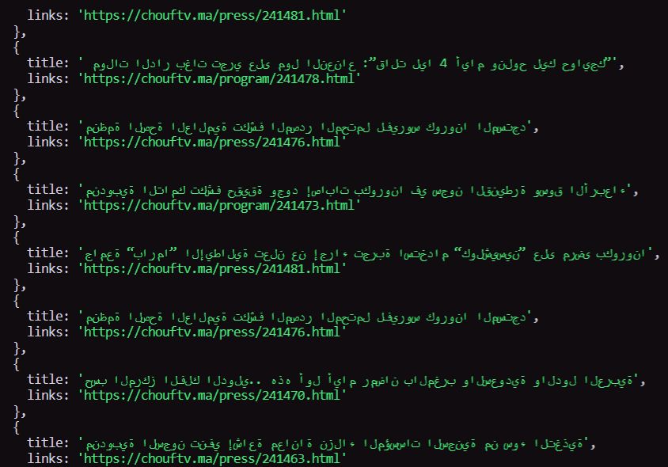

# 💩Scrapy💩

A small page scraper , still a WiP .
No dynamic scraping ...
This script uses :

<div align="center">


<h6><strong>A</strong>xios</h6>
</div>

## How to use

- **Install and run**

```javascript
npm install
```

```javascript
npm run scrapy
```

- **Change the website and add yours**

```javascript
axios.get("https://chouftv.ma/press");
```

- **Change the elements by the ones you desire**

```javascript
$(".description").each((index, element) => {
  const title = $(element).children().first().text();
  const links = $(element).children("a").attr("href");
});
```



```
It looks weird because i used it on a local news website.
```

- **Limitations**
  <details>
    
    <p>This is a shitty scrapper , i'm still learning.</p>
    <p>It doesn't scrap unloaded links. </p>

  

<p>In the screenshot above , the button litteraly translates to : LOAD MORE</p>
<p>Since i suck at this, i can't make it load more so i can grab the links</p>
<p>So it only grabs the latest news articles .</p>
<p>That's a blessing and a curse , beacause if clicked , it will load EVERY ARTICLE WRITTEN </p>
<p>since the deployement of the website... </p>
</details>

## Contact

```
you can contact me at ZTF666@protonmail.ch

```

<div align="center">

<table>
  <tr>
    <td align="center"><a href="https://ztfportfolio.web.app/" target='_blank'><br /><sub><b>ZTF666</b></sub></a></td>
  </tr>
</table>

</div>

## License

<div align="center">

**💩Scrapy💩** released under the [MIT](LICENSE) License.
<br><br>
<strong><p>Made with 💘 by a 👨‍💻 on a 💻 | 2020 | ZTF666 - N.EA</p> </strong>

</div>
